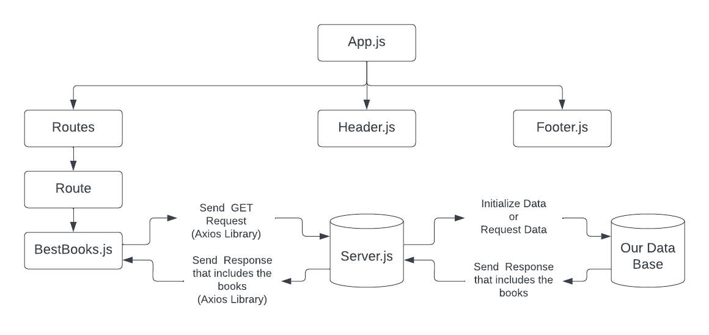

# Project Name

**Author**: Bashar Nobeh , Yazan Alfarra
**Version**: 1.0.0

## Overview
This server is connected to a mongoDB that contains data of books and it also have the ability to change , edit ,add remove data .

## Getting Started
-Create the server 
- connect it with the database 
- Create the react application 
- Have a contact between the server and the app (request and response ) using the routs 
-use the res data to view it on the app 

## Architecture

## Change Log

09-04-2022 5:00pm - Application now has a fully-functional express server, with a Books route for the location resource.
09-04-2022 6:00pm - Data is now availabe in the application and its saved into a state .
09-04-2022 6:20pm - The broweser contains the data of the best books .

## Estimates
Name of feature: ___MongoDB_____________________________

Estimate of time needed to complete: _20 mins____

Start time: _5:20____

Finish time: _5:40____

Actual time needed to complete: _20mins____

Name of feature: _server sending data to the db_______________________
________

Estimate of time needed to complete: _30 mins____

Start time: _5:40____

Finish time: __6:10___

Actual time needed to complete: _30 mins____

Name of feature: __rendering the data into the browser______________________________

Estimate of time needed to complete: _30 mins____

Start time: _6:20____

Finish time: _6:50____

Actual time needed to complete: _30 mins____

## Credit and Collaborations
Yazan Alfarra
https://github.com/yazanismail1

